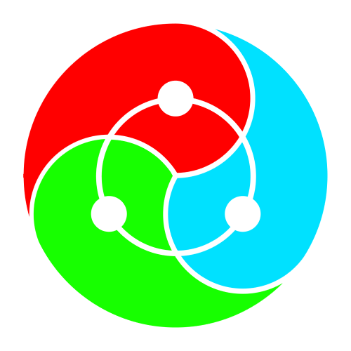

    

# 
 WeYouMe 

## 
 Social Media with a Positive Purpose.  

### 
 www.weyoume.io 

### WeYouMe is a Distributed Social Media Protocol for Sharing Information and Value Freely.

- Share content with friends and followers.
  - Articles, short text posts, images, audio, files, videos and more.
  - Integrated decentralized file hosting using [IPFS](https://ipfs.io) and [Bittorrent](https://www.bittorrent.com).
- Psudonymous Persona Accounts and Full Identity Profile accounts.
  - Persona Accounts enhance privacy and do not contain personal information.
  - Profile Accounts enable real identities, with selective profile information sharing.
- Boards for sharing content to selected sets of people.
  - Mulitple levels of privacy to encrypt content and manage account access.
  - Rewards for moderators based on the success of their boards. 
- Custom Assets that can be transferred between accounts, and exchanged in trading orders.
  - Your username is your wallet address.
  - Integrated decentralized exchange.
- Business Accounts with customizable transaction signing permissions.
  - Members and officers of a business can collaborate in account operations.
  - Stores for selling products via the marketplace.
- Integrated marketplace for buying and selling products.
  - Multiparty escrow system for staging funds.
  - Mediation system for dispute resolution.
- Content Creators earn MEC for creating content.
  - Rewards are distributed daily over 30 days.
  - Based on stake weighted votes, views, shares and comments.
- Crowdsourced moderation system that rewards participation.
  - Accounts select governance addresses to provide content management services.
  - Multiple content rating levels for audience display preferencing.
- Connections between users for sharing private keys and decrypting content.
  - Encrypted private messaging between connected accounts.
  - Private posting with selected audience groups.
- Hybrid Delegated Proof of Stake and Proof of Work consensus alogorithm.
  - Blocks produced and validated by a set of 100 Producers.
  - Block times of aprox 0.75 Seconds.
- Advertising Exchange System for interfaces and businesses.
  - Bidding for display on participating applications.
  - Users earn a portion of revenue from advertising viewed.

## [Read the WeYouMe Whitepaper for more information.](/WHITEPAPER.md)

## [This Software is released openly under the MIT license.](/LICENSE.md)

## [Read the Building Guide for node operating instructions.](/BUILDING.md)

## [Read the Producers guide to become a block producer.](/PRODUCERS.md)

# Economic Model:

## Two primary Currencies: WeYouMe (WYM) and MeCoin (MEC).

### WYM represents ownership of the WeYouMe protocol, and earns a share of network revenue.

- 10 Million WYM fixed supply, with no inflation.
- Active WYM stakeholder accounts earn a weekly reward.
- WYM stakeholders are able to vote for Producers.

### MEC is earned by network contributors, and is consumed to utilize network features.

- 1 Billion MEC issuance per year, with no initial supply.
- 25% of MEC issuance directed to content rewards, distributed according to stake weighted votes, views, shares and comments.
- 20% of MEC issuance directed to holders of WYM Cryptoequity when they are active on the network.
- 20% of MEC issuance is directed to Block Producers, which are elected by stakeholders, and create proofs of work.
- 10% of MEC issuance is directed to Supernode Operator rewards.
- 10% of MEC issuance is directed to Staked MeCoin Holder rewards.
- 5% of MEC issuance is directed to The Community Enterprise fund.
- 2.5% of MEC issuance is directed to The Development reward pool.
- 2.5% of MEC issuance is directed to The Marketing reward pool.
- 2.5% of MEC issuance is directed to The Advocacy reward pool.
- 2.5% of MEC issuance is directed to The Activity reward pool.

# Consensus Model:

## Hybrid between Delegated Proof of Stake and Proof of Work.

### Block producers are seleted by stake weighted votes.
- The top 50 elected voting producers particpate in each round of block production.
- 10 Additional random producers are selected each round proportionally to the votes received.
- Producer voting uses a ranked list, according to preference order.

### Block Producers are also selected by proof of work output.
- The top 50 Miners participate in each round of block production.
- 10 Additional random miners are selected each round, proportionally to their mining output.
- [X11 Mining algorithm](https://www.mycryptopedia.com/x11-algorithm-explained/) is used, with a 10 minute target time for proofs.

### Block rewards are distributed to Producing nodes:
- 40%: Base block reward to individual producer.
- 15%: Proof of work reward on each proof broadcast.
- 15%: Proof of Activity for each producer voted as rank 1 when claiming activity rewards.
- 15%: Proof of transaction stake, based on transactions included in blocks.
- 15%: Block Validatio reward, for commiting stake on incoming blocks.